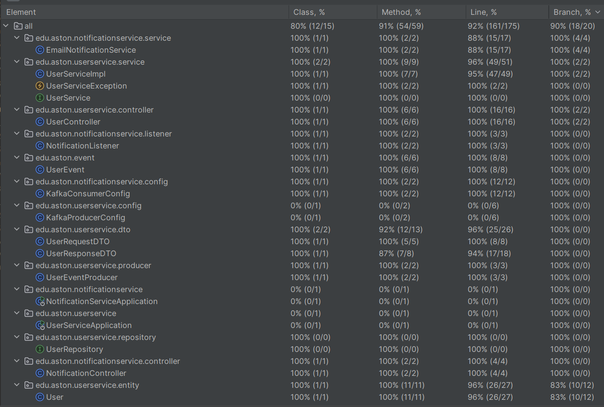

Видеоотчёт по модулю 6: https://youtu.be/H-dJNMWcA2s (в swagger'e, где delete() написано "Delete user information in the database" вместо "Update user information in the database". В исходниках описание исправлено).

